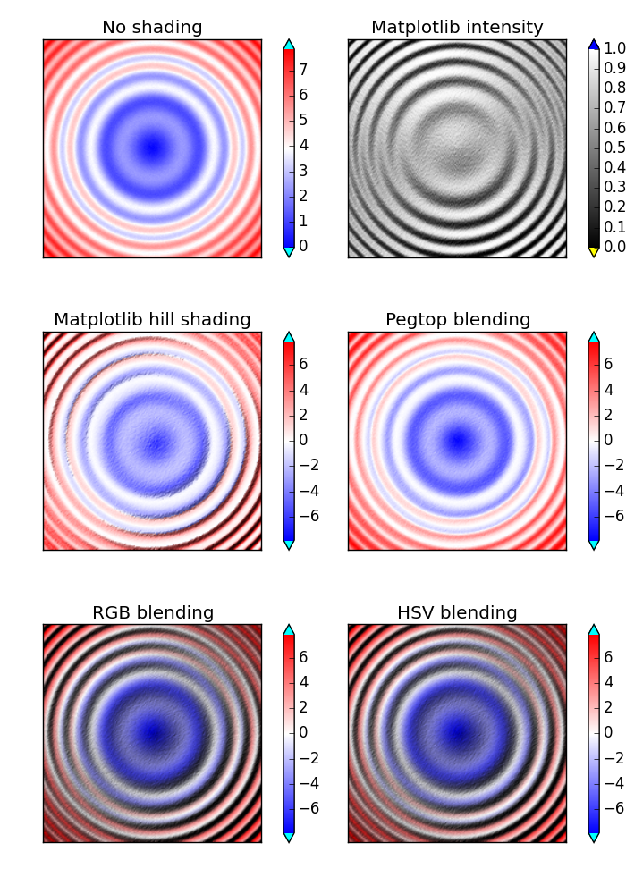

Hill shading implementation for Matplotlib
==========================================

Calculates a shaded relief given a 2D array of surface heights and one or 
more artificial light sources.


#### Installation

There is no installation script, just copy the `hillshade.py` and 
`intensity.py` files into your code. This software is released under the MIT 
license, please leave the license in the headers intact.

Requirements: _Matplotlib_ and _Numpy_.

#### Basic use

The main interface is the `hill_shade` function. Calling it can be as simple as:

```Python
from hillshade import hill_shade
import matplotlib.pyplot as plt

data = ... # define 2D array of surface heights
rgb = hill_shade(data)
plt.imshow(rgb)
```

Often you want to scale the terrain to make the relief visible, or you might 
want to use different datasets for the shading and for the color. This can be 
achieved by using different data and terrain arrays.

```Python
rgb = hill_shade(data, terrain=data * 10)
```

In the [basic use demo](demo_multi_source.py) you can see how to use a different
color map. The [combine data demo](demo_combine.py) demonstrates the use of a
separate data and terrain array.

The optional `azimuth` and `elevation` parameters can be used to specify the 
direction of the light source. They can be lists, in which case multiple sources
are used. See the [multipe light source demo](demo_multi_source.py).

The `hill_shade` doc-string explains the parameters in detail.

#### Rationale

Alltough Matplotlib comes with a [hill shading implementation](http://matplotlib.org/examples/pylab_examples/shading_example.html) 
I don't like the fact that it always normalizes the calculated intensities. This
means that it always shows heavy shades, even if the maximum relief is low. This 
implementation does not, you can increase the shades by scaling the terrain.
See the [intensity comparison](compare_intensity.py). 

Furthermore the Matplotlib hill shading relies heavily on the fact that the 
used colormap contains variation in intensity as well. That is, it doesn't work
well with color maps such as _rainbow_ or _bwr_. 

The [implementation by Ran Novitsky]
(http://rnovitsky.blogspot.nl/2010/04/using-hillshade-image-as-intensity.html)
differs from the Matplotlib implementation in how the colors are blended (it 
also allows for different data and terrain arrays, which is nice). However, 
I think the _RGB blending_ that this implementation uses gives better results 
than the _pegtop blending_ of Ran Novitsky's, since it's similar to the Gouraud 
shading that is used in 3D computer graphics. Of course, this may be subjective, 
you can experiment yourself in the [blending comparison](compare_blending.py). 
However, I think that the images below illustrate my point.


