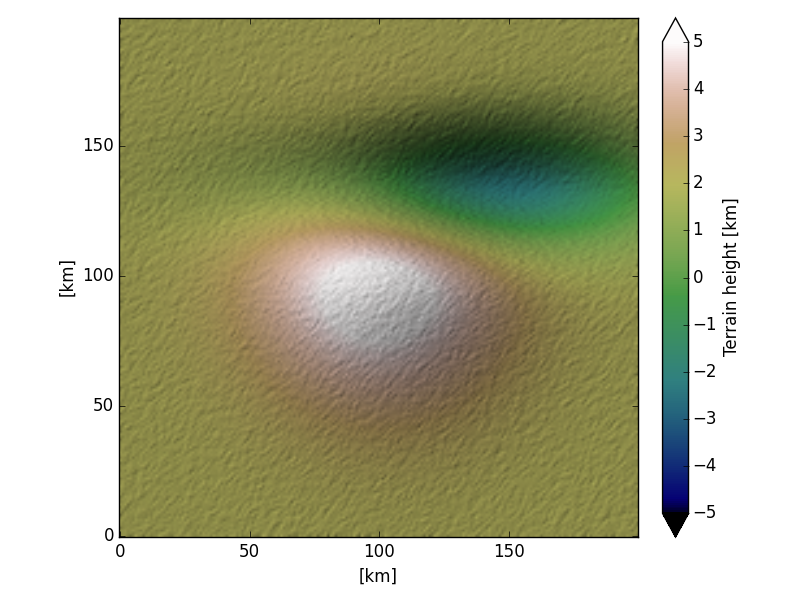

hill_shading
============

Hill shading implementation for Matplotlib.

It calculates a shaded relief given a 2D array of surface heights and one or 
more artificial light sources.



#### Installation:

There is no installation procedure, just copy the `hillshade.py` and 
`intensity.py` files into your code. This software is released under the MIT 
license, please leave the license in the headers intact.

Requirements: matplotlib and numpy.

#### Basic use:

The main interface is the `hill_shade` function. Calling it can be as simple as:

```Python
from hillshade import hill\_shade
import matplotlib.pyplot as plt
data = ... # define 2D array of surface heights
rgb = hill_shade(data)
plt.imshow(rgb)
```

Often you want to scale the terrain to make the relief visible. Or you want to
use different datasets for the shading and for the color. This can be done by
using different data and terrain arrays.

```Python
rgb = hill_shade(data, terrain=data * 10)
```

In the [basic use demo](demo_multi_source.py) you can see how to use a different
color map. The [combine data demo](demo_combine.py) demonstrates using seprate
data and terrain arrays.

The optional azimuth and elevation parameters can be used to specify the 
direction of the light source. They can be lists, in which case multiple sources
are used. See the [multipe light source demo](demo_multi_source.py)

The hill\_shade _docstring_ explaines the parameters in detail.

#### Rationale:

Altough Matplotlib comes with a [hill shading implementation](http://matplotlib.org/examples/pylab_examples/shading_example.html) 
I didn't like the fact that it always normalized the calculated intensites. This
means that it always shows heavy shades, even if the maximum relief is low. This 
implementation does not, you can increase the shades by scaling the terrain.
See the [intenstity comparison](compare_intensity.py). 

Futhermore the matplotlib hill shading relies heavily on the fact that the 
used colormap contains variation in intensity as well. That is, it doesn't work
well with color maps such as _rainbow_ or _bwr_. 

The [implementation by Ran Novitsky](http://rnovitsky.blogspot.nl/2010/04/using-hillshade-image-as-intensity.html)
implementation differs from the Matplotlib one in how the colors are blended (it 
also allows for different data and terrain arrays). However, I think the 
_RGB blending_ of my implementation gives better results than the _pegtop 
blending_ of Ran's version, as it is similar to the Phong illumination (without
specular component) that is used in 3D computer graphics. This may be 
subjective of course, so you can determine your preference in the 
[blending comparison](compare_blending.py).

